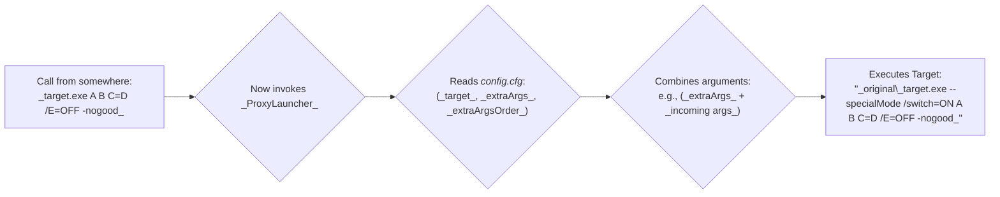

# ProxyLauncher

A tiny, zero-dependency Windows application that passes its command line arguments on to a executable, either prepending or appending additional arguments specified in a configuration file.

In simple terms: Want to always add specific arguments whenever a certain program is run, even if you can't change how it's started? ProxyLauncher can do this by replacing the original program and acting as an intermediary.

## Table of Contents
- [Overview](#overview)
- [Configuration](#configuration)
  - [Configuration Keys](#configuration-keys)
  - [Simple Usage](#simple-usage)
  - [Common Usage: Automatically Adding Arguments](#common-usage-automatically-adding-arguments)
- [Bonus](#bonus)
- [Building from Source](#building-from-source)
- [Example](#example)

## Overview<br>
ProxyLauncher serves as a wrapper for other executables, allowing you to add predefined arguments to the target application without modifying the original command line. This is particularly useful when you want to add command line arguments but have no control over its invocation, or you want to create a drop-in replacement for an existing executable which needs additional arguments to function.

Here's a simple illustration of how it works:



## Configuration

Create a configuration file with the same name as the executable but with a `.cfg` extension in the same directory. For example, if your executable is named `proxylauncher.exe`, the configuration file should be named `proxylauncher.cfg`.

The configuration file uses a simple key-value format:

```
target=path\to\target\application.exe
extraArgs=--arg1 --arg2 "argument with spaces" /switch=value
extraArgsOrder=before
```

### Configuration Keys

- `target`: Path to the target executable (absolute or relative to the ProxyLauncher's directory)
- `extraArgs`: Additional arguments to pass to the target executable
- `extraArgsOrder`: Determines whether the extra arguments are added before or after the command line arguments (valid values: `before` or `after`)

## Usage

### Simple Usage

Simply run the ProxyLauncher executable with any arguments you want to pass to the target application:

```
proxylauncher.exe arg1 arg2 arg3
```

Based on your configuration, ProxyLauncher will execute the target application with the combined arguments.

### Common Usage: Automatically Adding Arguments

Most commonly, ProxyLauncher is used to add arguments to an existing executable, even if you can't change how it's started.

Here's how to set it up:

1.  **Move or Rename the Original:** Locate the program you want to wrap (e.g., `target_app.exe`). You can either:
    *   **Rename it** in the same folder (e.g., to `target_app_original.exe`).
    *   **Move it** to a different folder (remembering its new location).
2.  **Replace with ProxyLauncher:** Copy `proxylauncher.exe` into the *original* program's folder and rename *it* to the original program's name (`target_app.exe`).
3.  **Create Configuration:** In the same folder as the new `target_app.exe` (which is ProxyLauncher), make a new text file named `target_app.cfg`. Inside this file, specify:
    *   `target=path\to\original\target_app_original.exe` (Use the new name or the full path if you moved it).
    *   `extraArgs=--your-extra --arguments "here"`
    *   `extraArgsOrder=before` (or `after`, depending on where you want the extra arguments)

**The Result:** Now, whenever `target_app.exe` is executed from its original location, it's actually ProxyLauncher running first. It reads the `.cfg` file, finds the *real* program (wherever you moved/renamed it), and then launches it with the combined arguments (your extra ones plus any arguments it was originally called with). The original program runs as intended, but with your predefined arguments automatically included!

## Bonus
When launching without an existing configuration file, ProxyLauncher will create a default configuration file and open it in Notepad. You'll just need to fill in the values.

## Building from Source

To build a static Windows executable with zero runtime dependencies:

```
go build -ldflags="-H windowsgui" -o proxylauncher.exe
```

The `-H windowsgui` flag creates a Windows GUI application (no console window).

## Example

If your configuration file is `proxylauncher.cfg` and contains:
```
target=.\child directory\another_program.exe
extraArgs=--specialMode /switch=ON
extraArgsOrder=before
```

And you run, with "C:\" being the working directory:
```
proxylauncher.exe A B C=D /E=OFF -nogood
```

The proxy launcher will execute:
```
"C:\path\to\child directory\another_program.exe" --specialMode /switch=ON A B C=D /E=OFF -nogood
